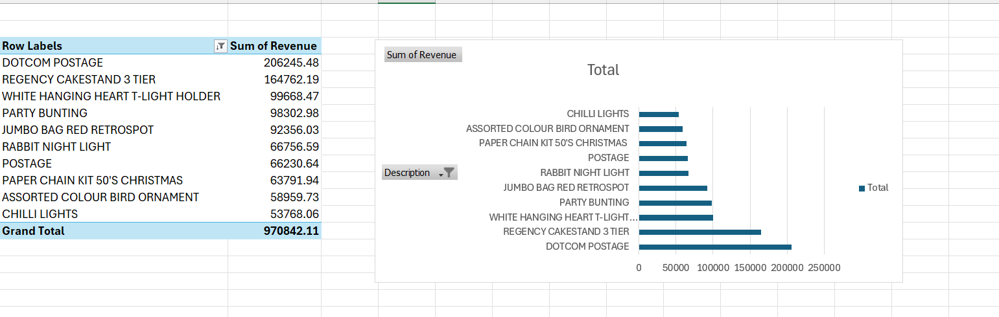

# online-retail-data-analysis
Excel-based data analysis project using pivot tables and charts

## Overview
This project analyzes retail sales data to identify trends and top-performing products using Excel.

## Tools Used
- Microsoft Excel
- Pivot Tables
- Data Cleaning Techniques

## Dataset
A cleaned sample of an online retail dataset (2000 rows) was used for analysis.

## Key Steps
- Cleaned dataset by removing errors and unnecessary data
- Created a Revenue column (Quantity × Unit Price)
- Built pivot tables to analyze product performance
- Identified top 10 products by revenue
- Created charts to visualize key insights

## Visualization

## Key Insights
- A small number of products generate the highest revenue
- High-performing items appear frequently across transactions

## Skills Demonstrated
- Data cleaning
- Data analysis
- Excel (Pivot Tables, formulas)
- Data visualization
- Reporting and communication
